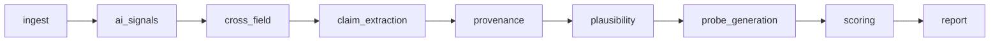

# depth-eval-engine — Execution Flow & Logic

How a request actually moves through the system, what each node computes, and the
exact math/decision rules. Source of truth is the code; file refs are clickable.

> **veritas update (PI-1/PI-2).** This engine is now the *vetting subsystem* of
> the veritas talent platform. Two peer docs cover what grew around it:
> [CANDIDATES.md](CANDIDATES.md) — the candidate data backbone (extraction,
> store, identity resolution, India normalization, POST /candidates) — and
> [FABRICATION.md](FABRICATION.md) — the fabrication-defense signals
> (`ai_signals` + `cross_field` nodes, resume-farm detection, and the unified
> `fabrication_risk` fused in scoring, S2.4). The pipeline is
> now **9 nodes**: two advisory fabrication nodes sit between `ingest` and
> `claim_extraction`. The stage numbering below retains the original seven stages plus 1a/1b.

---

## Architecture and source map

Routes in [routes.py](src/app/api/routes.py) call the shared ingest/service paths
or [EvaluationEngine](src/app/graph/build.py). The compiled graph runs nine nodes
in a fixed sequence; nodes return updates to [EvaluationState](src/app/graph/state.py).



| Boundary | Current implementation |
|---|---|
| Domain rules | [domains](src/app/domains): registry lookup by `state.domain`; no concrete-domain import in graph nodes. |
| Model calls | [llm.py](src/app/services/llm.py): configured tiers with deterministic fallbacks when unavailable. Model choices live in configuration. |
| Provenance | [provenance.py](src/app/graph/nodes/provenance.py): anchored GitHub facts cached within one evaluation and attached to the corresponding claims. No vector-store writes or queries. |
| Durable reports/outcomes | [reports/store.py](src/app/reports/store.py): SQLAlchemy storage on the configured candidate database, with migrations and erasure constraints. |
| Runtime observation | [flywheel.py](src/app/services/flywheel.py): non-retaining production observer; in-memory event capture for tests. Legacy JSONL cleanup is separate. |
| Service construction | [services](src/app/services/__init__.py): currently still constructs unused vector-store infrastructure and repeated SQL resources; simplification remains R4-S1-T1/T2. |
| Schemas/configuration | [schemas](src/app/schemas), [core](src/app/core), [migrations](alembic/versions). |
| Intake and UI | [screening](src/app/screening), [frontend](frontend); workflow contracts are in [SCREENING.md](SCREENING.md). |

The detailed stages below describe evidence and scoring behavior. For delivery
status and unresolved policy/quality gaps, use [FEATURE_STATUS.md](FEATURE_STATUS.md).
No LLM key means deterministic fallbacks; it does not establish model accuracy.

---

## Data flow (input → output)

`EvaluationState` grows field-by-field. Legend: `+` field added · `~` field mutated
· `ext` external call · `side-effect` write-out.

```
INPUT  (POST /evaluate)
  { resume_text | resume_pdf_b64 (one required), github_url?, portfolio_url?, domain="genai" }
   │
   ▼
┌─ ① ingest ──────────────────────────────────────────────────────────────────┐
│  in : raw_resume_text | resume_pdf_b64                                        │
│  out: + resume_text  (normalized)   + errors[] (if PDF/empty)                │
└──────────────────────────────────────────────────────────────────────────────┘
   │ resume_text
   ▼
┌─ ⑴ ai_signals · ⑵ cross_field  (advisory, PI-2 → FABRICATION.md) ───────────┐
│  in : resume_text (+ candidate_profile input when POST /candidates set it)   │
│  out: + ai_generation (AIGenerationAssessment)                               │
│       + cross_field   (CrossFieldAssessment)                                 │
│  never touch claims / verdicts / depth — attached to the Report at ⑦         │
└──────────────────────────────────────────────────────────────────────────────┘
   │ resume_text
   ▼
┌─ ② claim_extraction ────────────────────────────────────────────────────────┐
│  in : resume_text, github_url, portfolio_url                                 │
│  out: + claims[]  Claim{ text, claim_type, specificity, external_anchor? }   │
│       + candidate_context { role, employer_type, github_url, … }             │
└──────────────────────────────────────────────────────────────────────────────┘
   │ claims[]
   ▼
┌─ ③ provenance ──────────────────────────────────────────────────────────────┐
│  in : claims[].external_anchor, github_url                                   │
│  ext: GitHub API -> evaluation-local repo cache -> anchored claims       │
│  out: + provenance{ claim_id -> [evidence strings] }                         │
└──────────────────────────────────────────────────────────────────────────────┘
   │ claims[] + provenance{}
   ▼
┌─ ④ plausibility (THE CORE) ─────────────────────────────────────────────────┐
│  in : per claim → domain.rules ⊕ LLM(reasoning) ⊕ provenance                 │
│       rule: coherence = 0.30 + 0.55·fraction (− penalties / ± 'tells')       │
│       llm : {coherence, confidence, missing_signals} (conf ≤ 0.85)           │
│       fuse: confidence-weighted blend → (coherence, confidence)              │
│  out: + verdicts[] CoherenceVerdict{ coherence_score, confidence, reasoning, │
│              evidence[], expected/missing_signals, probes(seed) } (no status)│
└──────────────────────────────────────────────────────────────────────────────┘
   │ verdicts[] (scored, unclassified)
   ▼
┌─ ⑤ probe_generation ────────────────────────────────────────────────────────┐
│  in : verdicts where coherence_score < 0.35                                  │
│  ext: LLM(reasoning) scoped to missing_signals                               │
│  out: ~ verdicts[].probes  (augmented; coherent claims untouched)            │
└──────────────────────────────────────────────────────────────────────────────┘
   │ verdicts[] (+ probes)
   ▼
┌─ ⑥ scoring (calibration) ───────────────────────────────────────────────────┐
│  classify(): coh<0.35 AND conf≥0.70 → INCOHERENT │ conf<0.50 → DEFER         │
│              coh≥0.35 → COHERENT │ no evidence → UNVERIFIED                   │
│  out: ~ verdicts[].status                                                    │
│       + depth_score, overall_confidence, depth_band                          │
│         (DEEP≥.80 SOLID≥.60 EMERGING≥.40 else SUPERFICIAL; conf<.50 → INSUFFICIENT)│
│       + fabrication_risk (S2.4: fuses ai_generation ⊕ cross_field ⊕          │
│         resume_farm → advisory band; never touches verdicts/depth)           │
└──────────────────────────────────────────────────────────────────────────────┘
   │ verdicts[] (classified) + aggregates
   ▼
┌─ ⑦ report ──────────────────────────────────────────────────────────────────┐
│  observer: flywheel.log() is non-retaining in production                    │
│  out: + report (Report)                                                      │
└──────────────────────────────────────────────────────────────────────────────┘
   │
   ▼
OUTPUT  (Report)
  { id, domain, verdicts[]{coherence_score, confidence, status, reasoning,
    evidence[], probes[]}, depth_score, depth_band, overall_confidence,
    flagged_claim_ids[] (INCOHERENT), deferred_claim_ids[] (DEFER),
    advisory=true, human_review_required=true, summary,
    ai_generation?, cross_field?, resume_farm?, fabrication_risk? }
```

Status is assigned **only at ⑥** — plausibility produces scores without labels so
the conservative decision lives in exactly one place.

---

## 0. Entry

`POST /evaluate` → [routes.py](src/app/api/routes.py) builds an `EvaluationState`
([state.py](src/app/graph/state.py)) and calls `EvaluationEngine.evaluate()`
([build.py](src/app/graph/build.py)). The engine `ainvoke`s a compiled LangGraph.

The graph is a **linear chain** (no branches), wired in [build.py](src/app/graph/build.py#L34):

```
START → ingest → ai_signals → cross_field → claim_extraction → provenance
      → plausibility → probe_generation → scoring → report → END
```

There is a second entry point since S1.3: `POST /candidates` extracts a
`CandidateProfile`, ingests it into the candidate store, runs resume-farm
detection against the stored corpus, and *then* calls the same
`EvaluationEngine.evaluate(...)` — passing the extracted profile and the farm
assessment in as inputs (`candidate_profile`, `resume_farm` on
`EvaluationState`) and stamping `report.candidate_id` afterwards. The graph
itself stays candidate-store-blind. Full flow in
[CANDIDATES.md](CANDIDATES.md) and [FABRICATION.md](FABRICATION.md).

Each node returns a *partial dict*; LangGraph merges it into the single
`EvaluationState` threaded through the chain. Every field is written at most once,
so default LastValue channel semantics are correct (no reducers).

The whole pipeline runs **with or without an LLM key**. No key → `build_llm`
returns `NullLLM` (abstains, returns `""`/`{}`) and every node falls back to its
deterministic path. This is why the test suite is fully offline.

---

## 1. ingest — [ingest.py](src/app/graph/nodes/ingest.py)

**In:** `raw_resume_text` *or* `resume_pdf_b64`, plus optional `github_url` / `portfolio_url`.
**Logic:**
- If text present → use it. Else base64-decode the PDF and extract text with `pypdf`.
- PDF parse error → record `errors:["pdf_parse_failed: …"]`, return empty text (no crash).
- Empty after strip → `errors:["empty_resume"]`.

**Out:** `resume_text` (normalized). LLM-free, deterministic.

---

## 1a. ai_signals — [ai_signals.py](src/app/graph/nodes/ai_signals.py)  *(S2.1, advisory)*

Stylometry over the raw resume text: four deterministic detectors (template
phrases, uniform bullets, metric saturation, symmetric structure) fused with
an optional confidence-capped LLM pass on the `parsing` tier. Produces
`state.ai_generation` (`AIGenerationAssessment`), later attached to the
Report. **Never touches claims, scores, or bands.** Full detector math,
banding rules, and config knobs (`ai_*`): [FABRICATION.md](FABRICATION.md).

## 1b. cross_field — [cross_field.py](src/app/graph/nodes/cross_field.py)  *(S2.2, advisory)*

Deterministic timeline/coherence forensics over the extracted
`CandidateProfile` — **no LLM**. Uses `state.candidate_profile` when POST
/candidates supplied one; otherwise derives one via
`normalize_profile(heuristic_profile(text))`. Produces `state.cross_field`
(`CrossFieldAssessment`). Conservative interval math and the four checks
(`xf_*` knobs): [FABRICATION.md](FABRICATION.md).

---

## 2. claim_extraction — [claim_extraction.py](src/app/graph/nodes/claim_extraction.py)

Turns prose into **atomic, typed, checkable claims**.

**Primary path (LLM, `parsing` tier = FAST model):** prompt = the active domain's
`extraction_guidance()`; expects JSON `{candidate_context, claims:[…]}`. Each claim →
`{text, claim_type, specificity, external_anchor?}`.

**Fallback path (heuristic, runs if LLM returns nothing):** [_heuristic_extract](src/app/graph/nodes/claim_extraction.py#L61)
- Split résumé into lines; drop lines < 12 chars.
- Strip URLs out of the prose *before* classifying (so `.../rag-bot` in a URL
  doesn't get mistaken for a RAG claim).
- `claim_type` = first keyword group matched in `_TYPE_HINTS` (fine_tuning, rag,
  multi_agent, deployment, evaluation, data_pipeline, prompt_engineering). No match → line skipped.
- `specificity`: SPECIFIC if a named entity (`_NAMED`: llama/gpt-/claude/a100/lora/f1/p95…)
  **and** a digit are present; MODERATE if one; VAGUE if neither.
- GitHub URLs in the line → parsed into an `external_anchor {owner, repo}`.

**Consent step:** candidate-shared `github_url` / `portfolio_url` are folded into
`candidate_context` (first-party only — DPDP constraint).

**Out:** `claims: list[Claim]`, `candidate_context`.

---

## 3. provenance — [provenance.py](src/app/graph/nodes/provenance.py)

Grounds **only anchored claims** against **first-party** GitHub repos (no scraping).

**Logic:**
- Per claim: if it has an `external_anchor.repo`, fetch repo evidence via
  `services.github.gather_repo_evidence(owner, repo)`. Else if the candidate shared a
  top-level `github_url`, use that as soft grounding for the claim. Results cached per `(owner,repo)`.
- Evidence attaches directly to the claim's selected repo. The cache lives only
  for this evaluation; evidence is neither added to nor queried from the shared
  vector store. This prevents cross-candidate and cross-claim evidence leakage.

**Out:** `provenance: {claim_id → [evidence strings]}`. Empty for claims with no anchor.

---

## 4. plausibility — THE CORE — [plausibility.py](src/app/graph/nodes/plausibility.py)

For **each claim**, fuse two independent signals into one `(coherence, confidence)`.

### (a) Rule registry — deterministic ([genai.py `_SignalRule.evaluate`](src/app/domains/genai.py#L65))
For each rule whose `claim_types` match the claim:
- Build a haystack = claim text + excerpt + context notes + provenance.
- Each expected **signal category** (e.g. for fine_tuning: `dataset_source_and_size`,
  `eval_metrics`, `compute`, `method`) is `present` or `missing` by keyword match.
- `fraction = present / total_categories`
- **`coherence = 0.30 + 0.55 * fraction`** → range 0.30 (nothing) … 0.85 (all signals).
- VAGUE specificity → `coherence -= 0.12`.
- **Contradiction override ('tell')** via a detector, e.g.
  [_finetune_contradiction](src/app/domains/genai.py#L140):
  - Claims fine-tuning a **closed model** (gpt-4/claude/gemini) with no open model named →
    `coherence -= 0.35`, force a high-confidence flag.
  - Employer is `services_firm`/`unknown` **and** no compute named (gpu/a100/lora/cluster) →
    `coherence -= 0.18`.
- `decisiveness = |fraction − 0.5| * 2`; **`confidence = 0.45 + 0.40 * decisiveness`**
  (i.e. all-present or all-absent ⇒ more confident than half-and-half). A fired
  contradiction pins `confidence ≥ 0.85`.
- Emits a `RuleFinding` with reasoning, present/missing signals, and suggested probes.

### (b) LLM domain-expert pass (`reasoning` tier = REASONING model)
- System prompt = domain's `plausibility_system_prompt(context)` (senior-engineer persona
  primed with employer type / role / likely infra access).
- Returns JSON `{coherence, confidence, reasoning, expected_signals, missing_signals}`.
- `confidence` is **capped at 0.85** (`_LLM_MAX_CONFIDENCE`) so one model pass can't dominate.
- Any error / no key → returns `None` (contributes nothing; rules still drive).

### Fusion — [_fuse](src/app/graph/nodes/plausibility.py#L27)
Confidence-weighted across all `(coherence, confidence)` pairs (rules + LLM):

```
coherence  = Σ(coh·conf) / Σ(conf)          # weighted by each source's confidence
confidence = Σ(conf) / n_sources            # avg confidence, capped at 1.0
```

No signals at all → `(0.5, 0.0)` (neutral, zero confidence). GitHub provenance lines
are attached as supporting/contradicting `Evidence` (weight 0.4; "does not exist" → CONTRADICTS).

**Out:** one `CoherenceVerdict` per claim with `coherence_score`, `confidence`,
`reasoning`, `expected/missing_signals`, full `evidence[]`, seed `probes`.
**Status is NOT decided here** — that's calibration's job.

---

## 5. probe_generation — [probe_generation.py](src/app/graph/nodes/probe_generation.py)

Only claims with **`coherence_score < flag_coherence_threshold` (default 0.35)** get
LLM-crafted probes (`reasoning` tier), scoped to that claim's `missing_signals`.
Returns 1–3 questions; merged with rule-seeded probes, de-duped, capped at 5.
Coherent claims are skipped (no wasted calls). LLM error → keep the rule-seeded probes.

**Out:** verdicts with probes attached.

---

## 6. scoring — [scoring.py](src/app/graph/nodes/scoring.py) → [calibration.py](src/app/core/calibration.py)

No new judgment — applies the **conservative classifier** to each verdict.

### Per-claim status — [classify](src/app/core/calibration.py#L17)
In order:
1. no evidence → **UNVERIFIED**
2. `confidence < defer_confidence_threshold` (0.50) → **DEFER** (not sure enough to say anything)
3. `coherence < flag_coherence_threshold` (0.35) **AND** `confidence ≥ flag_min_confidence` (0.70) → **INCOHERENT** (the only path that flags)
4. `coherence ≥ 0.35` → **COHERENT**
5. otherwise (low coherence, mid confidence) → **DEFER**

> A claim is flagged **only** when it's clearly incoherent *and* we're confident.
> Every uncertain case defers to a human. False positives are the existential risk.

### Aggregate — [aggregate_depth](src/app/core/calibration.py#L43)
- `depth_score` = confidence-weighted mean of per-claim coherence.
- `overall_confidence` = mean confidence.
- If `overall_confidence < 0.50` → band = **INSUFFICIENT_SIGNAL** (don't pretend to rate).
- Else band by depth: ≥0.80 **DEEP**, ≥0.60 **SOLID**, ≥0.40 **EMERGING**, else **SUPERFICIAL**.

### Unified fabrication risk (S2.4) — [risk.py](src/app/fabrication/risk.py)
After the depth aggregate, scoring fuses whatever PI-2 assessments are on the
state (`ai_generation`, `cross_field`, `resume_farm`) into one advisory
`fabrication_risk` band — the fusion lives here because this *is* the
calibration stage, but it never touches verdicts, `depth_score`, or
`depth_band`. `None` when none of the three was ever assessed. Math and
banding in [FABRICATION.md](FABRICATION.md).

**Out:** finalized `verdicts`, `depth_score`, `overall_confidence`,
`depth_band`, `fabrication_risk`.

---

## 7. report — [report.py](src/app/graph/nodes/report.py)

Assembles the advisory `Report` and feeds the flywheel.

- `flagged_claim_ids` = verdicts with status INCOHERENT; `deferred_claim_ids` = DEFER.
- **Always sets `advisory=True` and `human_review_required=True`** — never auto-rejects (hard constraint #3).
- Human-readable `summary` with counts, depth band, and the advisory disclaimer.
  Advisory fabrication notes are appended only when loud enough:
  `ai_generation` at possible/likely, `cross_field` at major_issues,
  `resume_farm` at near_duplicate, `fabrication_risk` at moderate/elevated —
  each with explicit "never a rejection signal" copy.
- Attaches the PI-2 advisory assessments verbatim:
  `Report.ai_generation` / `Report.cross_field` / `Report.fabrication_risk`
  (from state) and `Report.resume_farm` (an API-layer input on POST
  /candidates; `null` on POST /evaluate). See [FABRICATION.md](FABRICATION.md).
- **Optional test observer:** one event per claim →
  `{evaluation_id, report_id, claim_id, claim_text, claim_type, coherence_score,
  confidence, status, probes, evidence_count, outcome:null}`.
  `outcome` is left open, closed later by a human/hiring signal — the training loop (constraint #6).
  Plus one record per present fabrication assessment
  (`record_type: "ai_signals" | "cross_field" | "resume_farm" |
  "fabrication_risk"`), also with `outcome: null`.
  Production uses `NullFlywheel`: these events are not persisted. Durable
  reports and labels remain in SQL; `flywheel_path` no longer opens a file.

**Out:** `report: Report` → persisted via `ReportStore` and returned by the API.

---

## 8. The outcome loop — [store.py](src/app/reports/store.py) + [routes.py](src/app/api/routes.py)

Reports are persisted through SQLAlchemy on the configured SQLite/PostgreSQL
candidate database (`reports` table). A human reviewer closes the loop after
the screen/interview:

```
POST /report/{id}/outcome  {outcome, claim_id?, notes?}
  outcome ∈ verified_genuine | verified_fabricated | candidate_clarified | inconclusive
  claim_id present → judgment on one claim; absent → on the whole report
```

**S8.5 gave this route an org-plane twin**, because the reviewer who actually
forms the judgment is the customer, not the operator:

```
POST /screening/reports/{id}/outcome   same body, 404 (never 403) if not yours
GET  /screening/reports/{id}/outcomes  THIS org's own judgments, oldest first
```

Both doors validate through one constructor (`src/app/reports/outcomes.py`), which
owns all three rules — the claim must belong to the report, `notes` must fit
`max_outcome_notes_chars`, and the record must state its own provenance
(`recorded_by` ∈ `operator | organization`, plus `org_id` and, when a human
rather than an `X-Org-Key` machine client is behind the call,
`recorded_by_org_user_id`).

Each judgment lands in the SQL `outcomes` table (queryable per report through
`GET /report/{id}/outcomes`). Labels, provenance and notes are retained there;
`outcomes → reports → candidates` CASCADE reaches them. The optional test
observer still receives a label/provenance event without notes, but production
retains no duplicate event stream. Existing JSONL files require separate cleanup.
`ReportStore.delete()` erases a report + outcomes for DPDP requests.

---

## Cross-cutting

- **Domain-agnostic core:** no node imports `genai`. They call `get_domain(state.domain)`
  ([base.py](src/app/domains/base.py)) for rules + prompt fragments. New domain = one module
  + `@register_domain`, zero graph changes (constraint #1).
- **Tiered LLM** ([llm.py](src/app/services/llm.py)): `parsing`→FAST, `reasoning`→REASONING,
  `reasoning_hard`→override, `bulk`→BULK. All via OpenRouter (OpenAI-wire-compatible).
  Resolution is config-driven in [config.py `model_for_tier`](src/app/core/config.py).
- **Explainability:** every verdict carries `evidence[]` + `reasoning` + `missing_signals`
  + `probes`. No bare "fake/real" label exists in the schema (constraint #2).
- **Calibration knobs** are all in `config.yaml` (`flag_*`, `defer_*`) — tune without code.

---

## Configuration & Decision Factors

Two layers ([config.py](src/app/core/config.py)):
- **`config.yaml`** — all non-sensitive tunables (models, thresholds, paths).
  Committed to git, reviewable, keys = field names (no prefix).
- **`.env`** — secrets ONLY (API keys/tokens), `DEE_`-prefixed, never committed.

Precedence (highest first): `constructor args > env (DEE_*) > .env > config.yaml > defaults`.
So any YAML value can be overridden per-deploy by setting the matching `DEE_*` env var,
and secrets never appear in YAML.

### A. What YOU fill in `.env` (secrets only)

| Variable | Required? | What to set | Default if blank |
|---|---|---|---|
| `DEE_OPENROUTER_API_KEY` | **Required for live LLM** | Your OpenRouter key `sk-or-…` | none → runs rule-only (`NullLLM`) |
| `DEE_GITHUB_TOKEN` | Optional | Read-only GitHub PAT | unauth (works, rate-limited) |
| `DEE_API_AUTH_KEY` | Optional | Shared secret; clients must send `X-API-Key` | none → API open (local/dev) |

That's it for "must touch." Everything below has a working default — change only
to tune cost/quality/behavior.

### B. Tunables in `config.yaml` (override only to tune)

YAML key (env override = `DEE_<KEY>`):

| `config.yaml` key | Default | Why this default |
|---|---|---|
| `openrouter_base_url` | `https://openrouter.ai/api/v1` | OpenRouter's OpenAI-compatible endpoint |
| `openrouter_app_url` / `_title` | `""` / `depth-eval-engine` | Optional OpenRouter attribution headers |
| `model_reasoning` | `qwen/qwen3.7-max` | Flagship reasoning for claim extraction + plausibility |
| `model_reasoning_hard` | `qwen/qwen3.7-max` | Override slot; point at a stronger model for the hardest cases |
| `model_fast` | `qwen/qwen3.6-flash` | Cheap structural parsing (the `parsing` tier) |
| `model_bulk` | `qwen/qwen3.6-35b-a3b` | Cheapest open-weight; future batch work (unused at M0) |
| `llm_max_tokens` | `4096` | Per-call output cap |
| `llm_timeout_seconds` | `60` | Per-call timeout |
| `llm_max_retries` | `2` | SDK retries w/ backoff; provider blips degrade to rules, not 500s |
| `github_api_base` | `https://api.github.com` | GitHub REST base (the *token* is a secret in `.env`) |
| `vectorstore_backend` | `chroma` | `chroma` \| `memory`. Chroma can hang on some machines — see next row |
| `vectorstore_init_timeout_seconds` | `15` | Bounded Chroma init; on timeout/error startup degrades to in-memory |
| `chroma_persist_dir` | `./.chroma` | Vector store on disk |
| `chroma_collection` | `depth-eval-evidence` | Collection name |
| `flywheel_path` | `./data/flywheel.jsonl` | Deprecated, ignored for new writes; legacy files are not automatically deleted |
| `report_db_path` | `./data/reports.db` | SQLite report store (reports + human outcomes) |
| `max_resume_chars` | `200000` | Evaluate-input cap; oversize → 422, never OOM |
| `max_pdf_b64_chars` | `14000000` | ≈10 MB PDF cap (base64 length) |
| `flag_coherence_threshold` | `0.35` | Below this = potentially incoherent |
| `flag_min_confidence` | `0.70` | Need ≥ this confidence to flag at all |
| `defer_confidence_threshold` | `0.50` | Below this = defer to human, never assert |
| `contact_hash_salt` | `veritas-dedup-v1` | Candidate identity dedup salt — NOT a secret, must stay stable (see [CANDIDATES.md](CANDIDATES.md)) |
| `candidates_db_url` | `sqlite:///./data/veritas.db` | Candidate store; Postgres = change string + `alembic upgrade head` |
| `ai_*` (4 keys) | see [FABRICATION.md](FABRICATION.md) | S2.1 AI-signal thresholds |
| `xf_*` (6 keys) | see [FABRICATION.md](FABRICATION.md) | S2.2 cross-field month thresholds |
| `rf_*` (7 keys) | see [FABRICATION.md](FABRICATION.md) | S2.3 resume-farm MinHash/banding knobs |
| `log_level` | `INFO` | Log verbosity |
| `log_json` | `true` | `true`=JSON (prod), `false`=console (dev) |
| `env` | `local` | `local` \| `staging` \| `prod` |

### C. Key decisions & the rationale (why it's built this way)

| Decision | Choice | Why |
|---|---|---|
| **LLM provider** | OpenRouter via the `openai` SDK | Vendor-neutral + economical; one wire-format reaches many models. Swapping a model = one `config.yaml` line, no code change. |
| **Reasoning model** | `qwen/qwen3.7-max` | Strongest current Qwen; the plausibility verdict quality matters most here. Override `_HARD` to e.g. `anthropic/claude-opus-4-8` through the same client for the hardest claims. |
| **Parsing model** | `qwen/qwen3.6-flash` | Claim extraction is structural, not deep — cheapest fast tier is right. |
| **Bulk model** | `qwen/qwen3.6-35b-a3b` | Cheapest ($0.14/$1.00), open-weight (self-hostable later), MoE-efficient. Heavy models are wrong for high-volume work. |
| **Conservative thresholds** | flag at coherence<0.35 **AND** confidence≥0.70; defer<0.50 | False positives (flagging a real person) are the existential risk. We only assert INCOHERENT when clearly incoherent *and* confident; every uncertain case defers to a human. |
| **Rule ⊕ LLM fusion** | confidence-weighted blend; LLM confidence capped at 0.85 | Deterministic rules give a defensible floor; the LLM adds nuance but can't single-handedly dominate a verdict. |
| **Always advisory** | `advisory=True`, `human_review_required=True`, no auto-reject | Hiring decisions stay human; the engine only surfaces evidence + probes. |
| **Consent-clean** | first-party GitHub/portfolio links only, no scraping | DPDP compliance — only candidate-shared data. |
| **Domain-agnostic core** | graph resolves `DomainModel` by `state.domain` | New domain = one file + `@register_domain`, zero graph changes. |
| **Embeddings** | local `HashingEmbedding` stand-in at M0 | Keeps M0 offline/reproducible. Swap for a real embedding model (separate from the chat tiers) for production retrieval quality. |

### D. Scoring constants (in code, not env — change deliberately)

| Constant | Value | Location |
|---|---|---|
| Rule coherence base / slope | `0.30 + 0.55·fraction` | [genai.py](src/app/domains/genai.py#L85) |
| Vague-specificity penalty | `−0.12` | [genai.py](src/app/domains/genai.py#L87) |
| Rule confidence | `0.45 + 0.40·decisiveness` | [genai.py](src/app/domains/genai.py#L108) |
| Closed-model 'tell' penalty | `−0.35` (confidence pinned ≥0.85) | [genai.py](src/app/domains/genai.py#L146) |
| LLM confidence cap | `0.85` | [plausibility.py](src/app/graph/nodes/plausibility.py#L24) |
| Depth bands | DEEP≥0.80, SOLID≥0.60, EMERGING≥0.40, else SUPERFICIAL | [calibration.py](src/app/core/calibration.py#L63) |

---

## End-to-end example (fabricated résumé, offline)

1. ingest: text in.
2. claim_extraction (heuristic): line *"Fine-tuned GPT-4 to improve accuracy"* →
   `claim_type=fine_tuning`, `specificity=VAGUE` (named model, no digit → actually MODERATE if a number appears).
3. provenance: no anchor → no grounding.
4. plausibility: fine_tuning rule → few signal categories present (`fraction` low →
   `coherence ≈ 0.30–0.41`), **closed-model contradiction fires** → `coherence −0.35`,
   `confidence` pinned ≥ 0.85.
5. probe_generation: coherence < 0.35 → probes like *"Which base model + method (LoRA/QLoRA),
   and on what GPU hardware?"*.
6. scoring: `coherence < 0.35` & `confidence ≥ 0.70` → **INCOHERENT**.
7. report: claim in `flagged_claim_ids`, full evidence + probes, `human_review_required=True`.

This is exactly what [tests/test_integration.py](tests/test_integration.py) asserts:
fabricated → flagged **with evidence**; genuine → **not** flagged.
